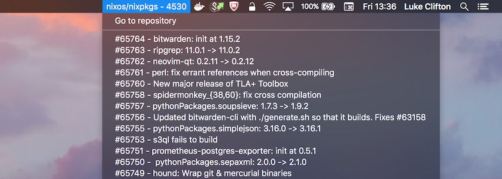

# Barbly

Barbly allows you to create status bar menus for macOS. It's similar to
[bitbar](https://github.com/matryer/bitbar) and supports some of the same
syntax.

Each instance of a barbly executable creates only one menu item. You specify
the period at which to refresh, and the command to generate the menu contents.

The first line becomes the title of the menu, and subsequent items become
the contents of the menu, with possible clickable actions.

    # Create a clock based on the output of the `date` command. Updates every
    # second.
    barbly --period 1 date

## Syntax

First line creates a title, subsequent lines create menu entries. An entry
that contains a `|` character can provide extra metadata. Currently the
only supported metadata is `href=`, to which you can supply a URL (include
the scheme!) or a file that will be opened with the default viewer.

For example, if you write the following script, and call it disks.sh

    #! /usr/bin/env bash
    
    echo "Disk Usage"
    df | tail -n +2 | tr -s ' ' | awk '{print($6" - "$5" | href="$6)}'

You can then run `barbly -p 30 ./disks.sh` to create a status bar menu
which lists all your disks and how full they are. When you select one
of the disks from the menu, it will open it in the default viewer for
directories (probably Finder). It will update every 30 seconds.

